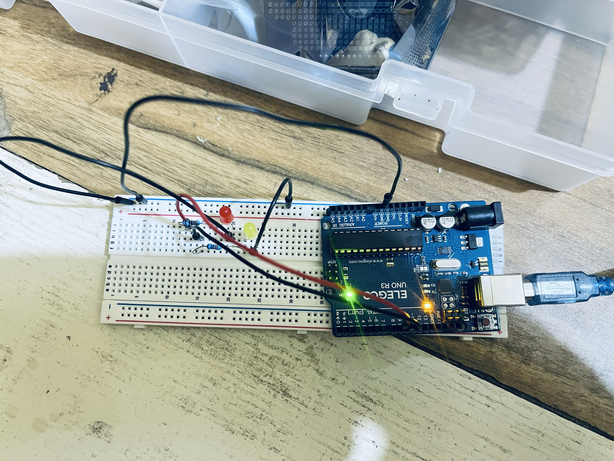
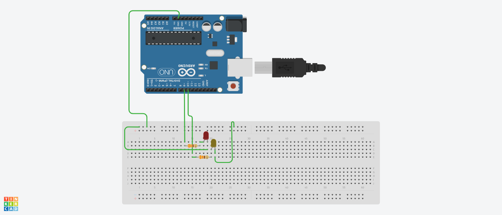

# Arduino Alternating LED Blinker

## Project overview

This is my first Arduino project.

The project uses an Arduino Uno to control two LEDs. The red LED blinks three times, followed by the yellow LED blinking three times. The sequence repeats continuously.

Before building the physical circuit, I designed and tested it using Tinkercad. This helped me confirm the circuit connections, resistor placement, Arduino pin assignments, and program behaviour.

## Physical circuit

### Circuit overview

The image below shows the completed physical circuit built with an Arduino Uno and a breadboard.



### LEDs blinking

The image below shows the LEDs during the blinking sequence.


## Tinkercad simulation

I first designed and tested the circuit in Tinkercad before assembling the physical version.

### Digital circuit overview



## Simulation and circuit files

The following files were exported from the Tinkercad simulation:

* [Component list](simulation/components_list.csv)
* [Circuit schematic](simulation/schematic.pdf)
* [Digital circuit overview](simulation/digital-circuit-overview.png)
* [Electrical circuit board file](simulation/electrical-circuit-file.brd)

## Components used

* Arduino Uno
* Breadboard
* Red LED
* Yellow LED
* 330 Ω current-limiting resistors
* Jumper wires
* USB cable

The complete component list exported from Tinkercad is available in [`components_list.csv`](simulation/components_list.csv).

## Circuit connections

| Component              | Arduino connection                |
| ---------------------- | --------------------------------- |
| Red LED                | Digital pin 9                     |
| Yellow LED             | Digital pin 10                    |
| LED ground connections | Arduino GND                       |
| Resistors              | Connected in series with the LEDs |

The resistors limit the amount of current flowing through the LEDs. This helps protect both the LEDs and the Arduino output pins from excessive current.

## How the program works

The Arduino program contains two main functions: `setup()` and `loop()`.

### `setup()`

The `setup()` function runs once when the Arduino is powered on or reset.

It configures digital pins 9 and 10 as output pins:

```cpp
pinMode(LedPinRed, OUTPUT);
pinMode(LedPinYellow, OUTPUT);
```

### `loop()`

The `loop()` function runs repeatedly after `setup()` finishes.

The program uses two `for` loops:

1. The first loop makes the red LED blink three times.
2. The second loop makes the yellow LED blink three times.
3. After both loops finish, the complete sequence starts again.

The `digitalWrite()` function controls the electrical signal sent from each Arduino pin.

* `HIGH` turns the connected LED on.
* `LOW` turns the connected LED off.

The `delay()` function controls how long each LED remains on or off. In this project, each delay lasts 250 milliseconds.

## Program sequence

```text
Red LED ON
Red LED OFF
Repeat three times

Yellow LED ON
Yellow LED OFF
Repeat three times

Restart the complete sequence
```

## Source code

The complete Arduino program is available in:

[`arduino-alternating-leds.ino`](arduino-alternating-leds.ino)

## What I learned

Through this project, I learned:

* how to design and test a circuit using Tinkercad;
* how to assemble an Arduino circuit physically;
* how to connect LEDs to an Arduino Uno;
* why LEDs require current-limiting resistors;
* how to configure Arduino digital pins as outputs;
* how to use `digitalWrite()` to control LEDs;
* how to use `delay()` to control timing;
* how to use `for` loops to repeat instructions;
* how the Arduino `setup()` and `loop()` functions work;
* how to export circuit files from Tinkercad;
* how to document an Arduino project on GitHub.

## Possible future improvements

Future versions of this project could:

* allow the blinking speed to be changed;
* use a push button to start or stop the sequence;
* add more LEDs and blinking patterns;
* use functions to reduce repeated code;
* use `millis()` instead of `delay()`;
* allow both LEDs to blink independently;
* use a potentiometer to control the blinking speed.

## Repository structure

```text
arduino-alternating-leds/
├── README.md
├── arduino-alternating-leds.ino
├── images/
│   ├── circuit-overview.jpg
│   └── leds-blinking.jpg
└── simulation/
    ├── components_list.csv
    ├── schematic.pdf
    ├── digital-circuit-overview.png
    └── electrical-circuit-file.brd
```
